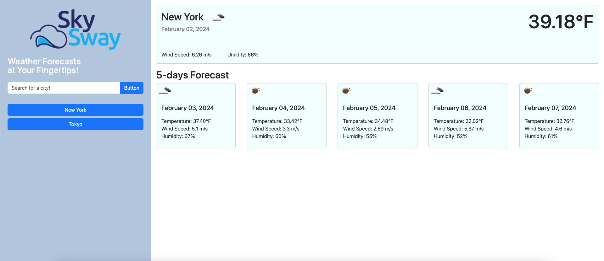
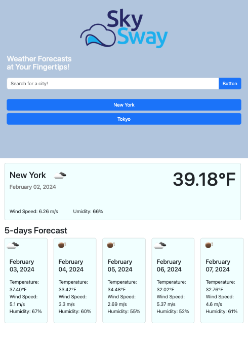
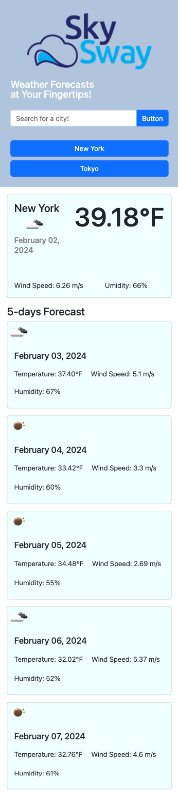

# Sky Sway - Your Personal Weather Guide

## Project Description
Sky Sway is a user-friendly weather forecast application that puts weather information at your fingertips. With a sleek and intuitive interface, Sky Sway allows you to effortlessly access current weather conditions and a 5-day forecast for any city in the world. Stay informed about temperature, wind speed, humidity, and more, and keep track of your recent searches with our convenient search history feature. Whether you're planning a trip or simply need to know what to expect in your local area, Sky Sway is your go-to companion for reliable weather forecasts. Never be caught off guard by the weather again – trust Sky Sway to keep you prepared and informed.

## Mock-Up
The following image shows the web application's appearance on desktops' screen:

The following image shows the web application's appearance on tablets' screen:

The following image shows the web application's appearance on smartphones' screen:

## Credits
- [w3schools.com](https://www.w3schools.com/)
- [developer.mozilla.org](https://developer.mozilla.org/en-US/)
- [getbootstrap.com](https://getbootstrap.com/docs/5.3/getting-started/introduction/)
- [openweathermap.org](https://openweathermap.org/)

## Repository and Webpage link

- [Repository Link](https://github.com/marphco/sky-sway)
- [Deployed Application Link](https://marphco.github.io/sky-sway/)